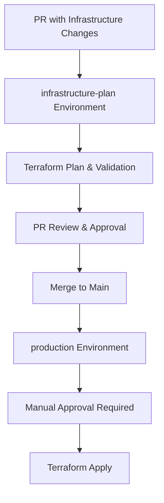

# GitHub Environments Configuration

This document describes how to configure GitHub Environments for the infrastructure pipeline to work properly with Scaleway.

## Required Environments

### 1. `infrastructure-plan` Environment

**Purpose**: Used for Terraform validation and planning on pull requests.

**Configuration**:
- **Protection Rules**: None (allows automatic execution)
- **Required Reviewers**: None
- **Wait Timer**: None
- **Deployment Branches**: Any branch

**Usage**: Automatically used when PRs contain infrastructure changes.

### 2. `production` Environment

**Purpose**: Used for deploying infrastructure changes to production.

**Configuration**:
```yaml
Protection Rules:
  - Required Reviewers: 1 (minimum)
  - Deployment Branches: main only
  - Wait Timer: 0 minutes (optional: set to 5 minutes for safety)
```

**Required Reviewers**: At least one team member with infrastructure permissions.

**Usage**: Automatically used when merging infrastructure changes to main branch.

## Setup Instructions

### Step 1: Create Environments

1. Navigate to your GitHub repository
2. Go to **Settings** → **Environments**
3. Click **New environment**

### Step 2: Configure `infrastructure-plan`

1. **Name**: `infrastructure-plan`
2. **Protection Rules**: Leave empty (no restrictions)
3. **Environment Secrets**: None needed (inherits from repository)
4. **Environment Variables**: None needed
5. Click **Configure environment**

### Step 3: Configure `production`

1. **Name**: `production`
2. **Protection Rules**:
   - ✅ **Required reviewers**: Add team members
   - ✅ **Restrict deployments to selected branches**: `main`
   - ⚠️ **Wait timer**: 0 minutes (or 5 for extra safety)
3. **Environment Secrets**: None needed (inherits from repository)
4. **Environment Variables**: None needed
5. Click **Configure environment**

## Environment Usage in Workflows

### Infrastructure Pipeline Flow



### Workflow Environment Mapping

| Job | Environment | Trigger | Protection |
|-----|-------------|---------|------------|
| `terraform-check` | None | All infrastructure changes | None |
| `terraform-plan` | `infrastructure-plan` | PRs only | None |
| `terraform-apply` | `production` | Main branch push | Manual approval |
| `terraform-destroy` | `production` | Manual dispatch | Manual approval |

## Security Considerations

### Repository-Level Secrets

These secrets are available to all environments:

- `SCALEWAY_ACCESS_KEY`
- `SCALEWAY_SECRET_KEY`
- `SCALEWAY_ORGANIZATION_ID`
- `DATABASE_PASSWORD`

### Environment-Specific Configuration

Currently, no environment-specific secrets are needed, but you can add them if required:

```yaml
# Example: Environment-specific database passwords
production:
  - DATABASE_PASSWORD_PROD: "production-specific-password"
  
infrastructure-plan:
  - DATABASE_PASSWORD_DEV: "development-specific-password"
```

## Best Practices

### Reviewer Selection

Choose reviewers who:
- ✅ Understand Scaleway infrastructure
- ✅ Can review Terraform code
- ✅ Understand cost implications
- ✅ Have access to Scaleway console

### Approval Process

For production deployments:

1. **Technical Review**: Code and Terraform plan review
2. **Impact Assessment**: Cost and service impact analysis
3. **Security Review**: Security implications check
4. **Approval**: Manual approval to proceed

### Emergency Procedures

For urgent infrastructure fixes:

1. **Hotfix Branch**: Create from main
2. **Fast Track**: Streamlined review process
3. **Post-Deployment**: Document changes immediately
4. **Monitoring**: Enhanced monitoring after emergency changes

## Troubleshooting

### Common Issues

#### ❌ Environment Not Found
```
Error: Environment 'production' not found
```
**Solution**: Create the missing environment in repository settings.

#### ❌ Missing Required Reviewers
```
Error: Required reviewers not configured
```
**Solution**: Add team members as required reviewers in environment protection rules.

#### ❌ Branch Protection Conflicts
```
Error: Deployment to production denied
```
**Solution**: Ensure the branch is allowed in environment deployment branch rules.

### Validation Commands

Test environment configuration:

```bash
# Check workflow syntax
gh workflow view infrastructure.yml

# List environments
gh api repos/:owner/:repo/environments

# Check environment protection rules
gh api repos/:owner/:repo/environments/production
```

## Integration with Existing Workflows

### Build and Deploy Pipeline

The infrastructure pipeline integrates with existing workflows:

```yaml
# Typical workflow sequence
1. Code Changes → test.yml (Unit Tests)
2. Code Changes → build.yml (Docker Build)
3. Infrastructure Changes → infrastructure.yml (Plan)
4. PR Approval → infrastructure.yml (Apply)
5. New Container → deploy.yml (Application Deploy)
```

### Dependency Management

Infrastructure changes may require coordinated deployments:

- **Database Schema Changes**: Coordinate with application deployment
- **Container Configuration**: May require application rebuild
- **Network Changes**: May affect existing services

---

For more information:
- [GitHub Environments Documentation](https://docs.github.com/en/actions/deployment/targeting-different-environments/using-environments-for-deployment)
- [Infrastructure PR Guide](./INFRASTRUCTURE_PR_GUIDE.md)
- [Scaleway API Documentation](https://developers.scaleway.com/)