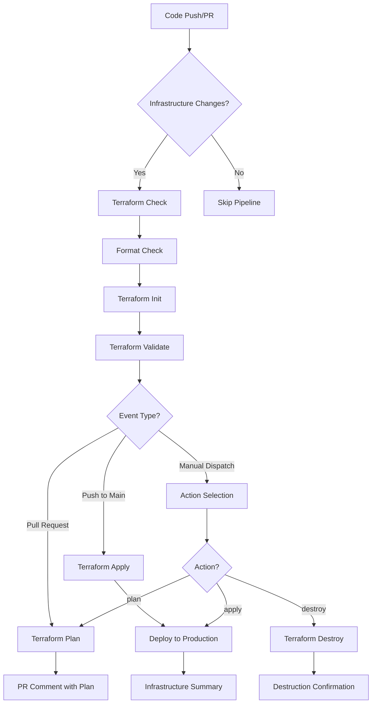

# Infrastructure Pipeline Overview

This document provides a comprehensive overview of the infrastructure pipeline implementation for the Clercq.It project with Scaleway.

## Pipeline Architecture

### Workflow: `infrastructure.yml`

The infrastructure pipeline is implemented as a GitHub Actions workflow that automates Terraform-based infrastructure management on Scaleway.



## Pipeline Features

### ✅ Automated Validation
- **Format Checking**: Ensures Terraform code follows consistent formatting
- **Syntax Validation**: Validates Terraform configuration syntax
- **Plan Generation**: Creates execution plans for infrastructure changes
- **Dependency Resolution**: Automatically handles resource dependencies

### 🔒 Security & Compliance
- **Secret Management**: Secure handling of Scaleway credentials
- **Environment Protection**: Production deployments require manual approval
- **Access Control**: Role-based access to infrastructure operations
- **Audit Trail**: Complete history of infrastructure changes

### 📊 Monitoring & Reporting
- **Status Badges**: Real-time pipeline status in README
- **Deployment Summaries**: Detailed infrastructure state reporting
- **Error Handling**: Comprehensive error reporting and troubleshooting
- **Cost Tracking**: Resource tagging for cost monitoring

### 🚀 Deployment Flexibility
- **Multi-Environment**: Support for different deployment environments
- **Manual Override**: Manual deployment control when needed
- **Rollback Capability**: Infrastructure destruction for rollbacks
- **Branch Protection**: Automatic deployment from main branch

## Infrastructure Components

### Scaleway Resources

| Resource | Purpose | Configuration |
|----------|---------|---------------|
| **Serverless Container** | Application hosting | 0-1 vCPU, 128MB memory, auto-scaling |
| **Serverless SQL Database** | PostgreSQL database | db-dev-s instance, 5GB storage |
| **Container Namespace** | Resource organization | Portfolio namespace with proper tagging |
| **Domain Configuration** | Custom domain support | Optional custom domain mapping |

### Resource Optimization

- **Cost Efficiency**: Resources scale to zero when unused
- **Performance**: Minimal resource allocation for development
- **Scalability**: Automatic scaling based on demand
- **Monitoring**: Built-in observability with Scaleway native tools

## Integration Points

### GitHub Integration

```yaml
Triggers:
  - Push to main (infrastructure path)
  - Pull requests (infrastructure path)
  - Manual workflow dispatch
  
Environments:
  - infrastructure-plan (PR validation)
  - production (deployment approval)
  
Secrets Required:
  - SCALEWAY_ACCESS_KEY
  - SCALEWAY_SECRET_KEY
  - SCALEWAY_ORGANIZATION_ID
  - DATABASE_PASSWORD
```

### Application Integration

The infrastructure pipeline integrates with the application deployment pipeline:

1. **Container Updates**: New application versions trigger container updates
2. **Database Migrations**: Coordinated with application deployments
3. **Configuration Changes**: Environment variables and settings updates
4. **Health Monitoring**: Application health checks after infrastructure changes

## Workflow Jobs

### 1. `terraform-check`
**Purpose**: Validates Terraform configuration
- Runs on all infrastructure changes
- No environment protection
- Provides feedback to PR authors

### 2. `terraform-plan`
**Purpose**: Creates deployment plan
- Runs on pull requests only
- Uses `infrastructure-plan` environment
- Comments plan results on PR

### 3. `terraform-apply`
**Purpose**: Deploys infrastructure
- Runs on main branch push
- Uses `production` environment
- Requires manual approval

### 4. `terraform-destroy`
**Purpose**: Destroys infrastructure
- Manual dispatch only
- Uses `production` environment
- Requires manual approval

## Configuration Files

### Terraform Configuration

| File | Purpose |
|------|---------|
| `main.tf` | Primary infrastructure definition |
| `variables.tf` | Input variable definitions |
| `outputs.tf` | Output value definitions |
| `terraform.tfvars.example` | Example variable values |

### Documentation

| File | Purpose |
|------|---------|
| `infrastructure/README.md` | Infrastructure setup guide |
| `infrastructure/SECRETS.md` | GitHub secrets configuration |
| `docs/INFRASTRUCTURE_PR_GUIDE.md` | PR configuration guide |
| `docs/GITHUB_ENVIRONMENTS.md` | Environment setup guide |

## Best Practices Implementation

### 🛡️ Security Best Practices
- Secrets stored in GitHub Secrets
- API keys with minimal required permissions
- Infrastructure state not stored in repository
- Regular security audits and key rotation

### 📋 Development Best Practices
- Infrastructure as Code (IaC) with Terraform
- Version-controlled infrastructure changes
- Automated testing and validation
- Peer review for all infrastructure changes

### 🔄 Operational Best Practices
- Blue-green deployment capability
- Automated rollback procedures
- Comprehensive monitoring and alerting
- Regular backup and disaster recovery testing

## Usage Examples

### Creating Infrastructure PR

```bash
# 1. Create feature branch
git checkout -b feature/add-redis-cache

# 2. Modify infrastructure
cd infrastructure/terraform
# Edit main.tf to add Redis resource

# 3. Validate locally
terraform fmt
terraform validate

# 4. Create PR
git add .
git commit -m "Add Redis cache for session storage"
git push origin feature/add-redis-cache

# 5. PR automatically triggers:
#    - Terraform validation
#    - Plan generation
#    - PR comments with results
```

### Manual Infrastructure Operations

```bash
# Plan infrastructure changes
gh workflow run infrastructure.yml -f action=plan

# Apply infrastructure changes
gh workflow run infrastructure.yml -f action=apply

# Destroy infrastructure (emergency)
gh workflow run infrastructure.yml -f action=destroy
```

## Monitoring and Alerting

### Pipeline Monitoring

- **GitHub Status Badges**: Real-time pipeline status
- **Workflow Notifications**: Email/Slack notifications for failures
- **Resource Monitoring**: Scaleway console integration
- **Cost Alerts**: Automatic cost threshold notifications

### Application Monitoring

- **Health Checks**: Automated health verification post-deployment
- **Performance Metrics**: Response time and throughput monitoring
- **Error Tracking**: Automatic error detection and reporting
- **Log Aggregation**: Centralized logging for troubleshooting

## Troubleshooting

### Common Issues and Solutions

| Issue | Cause | Solution |
|-------|-------|----------|
| Terraform state lock | Concurrent runs | Wait for completion or manual unlock |
| API key permissions | Insufficient permissions | Update Scaleway API key permissions |
| Resource quotas | Scaleway limits reached | Request quota increase or cleanup resources |
| Configuration errors | Invalid Terraform syntax | Run local validation before PR |

### Support Resources

- **Documentation**: Comprehensive guides in `/docs/` directory
- **GitHub Issues**: Template for infrastructure-related issues
- **Team Support**: Designated infrastructure team members
- **Escalation**: Direct Scaleway support for platform issues

## Future Enhancements

### Planned Improvements

- [ ] **Multi-Environment Support**: Dev, staging, production environments
- [ ] **Advanced Monitoring**: Custom dashboards and alerting rules  
- [ ] **Automated Testing**: Infrastructure testing with Terratest
- [ ] **Backup Automation**: Automated backup and restore procedures
- [ ] **Compliance**: Security scanning and compliance reporting

### Scalability Considerations

- [ ] **Resource Scaling**: Dynamic resource allocation based on usage
- [ ] **Geographic Distribution**: Multi-region deployment support
- [ ] **High Availability**: Enhanced HA configuration
- [ ] **Disaster Recovery**: Cross-region backup and failover

---

## Quick Reference

### Essential Commands
```bash
# Local development
terraform fmt -check -recursive .
terraform validate
terraform plan

# GitHub workflow triggers
gh workflow run infrastructure.yml -f action=plan
gh workflow run infrastructure.yml -f action=apply
```

### Key URLs
- **Scaleway Console**: https://console.scaleway.com/
- **GitHub Actions**: https://github.com/Echarnus/Clercq.It/actions
- **Docker Hub**: https://hub.docker.com/r/echarnus/clercq-it

### Documentation Links
- [Infrastructure Setup](../infrastructure/README.md)
- [PR Configuration Guide](./INFRASTRUCTURE_PR_GUIDE.md)
- [GitHub Environments](./GITHUB_ENVIRONMENTS.md)
- [Secrets Configuration](../infrastructure/SECRETS.md)