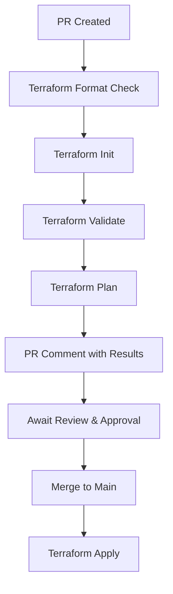

# Infrastructure Pull Request Configuration Guide

This guide explains how to properly configure pull requests that involve infrastructure changes for the Clercq.It project with Scaleway.

## Prerequisites

Before creating a PR with infrastructure changes, ensure the following are configured in your GitHub repository:

### Required GitHub Secrets

Navigate to **Settings → Secrets and Variables → Actions → Secrets** and ensure these secrets are set:

#### Scaleway API Credentials

| Secret Name | Description | How to Obtain |
|-------------|-------------|---------------|
| `SCALEWAY_ACCESS_KEY` | Scaleway API access key | Go to [Scaleway Console](https://console.scaleway.com/) → Profile → API Keys → Create/Copy Access Key |
| `SCALEWAY_SECRET_KEY` | Scaleway API secret key | Same as above → Copy Secret Key (shown only once) |
| `SCALEWAY_ORGANIZATION_ID` | ClercqIt organization ID | Scaleway Console → Click organization name → Copy Organization ID |

#### Application Secrets

| Secret Name | Description | Requirements |
|-------------|-------------|--------------|
| `DATABASE_PASSWORD` | PostgreSQL database password | 12+ characters, mixed case, numbers, special chars |

### Optional GitHub Variables

Navigate to **Settings → Secrets and Variables → Actions → Variables** for these optional settings:

| Variable Name | Description | Default Value |
|---------------|-------------|---------------|
| `CONTAINER_IMAGE` | Docker image to deploy | `echarnus/clercq-it:latest` |
| `CUSTOM_DOMAIN` | Custom domain (optional) | Empty (uses Scaleway domain) |

## Pull Request Workflow

### 1. Infrastructure Changes Detection

The infrastructure pipeline (`infra.yml`) automatically triggers when:

- **Push to main**: Changes in `infrastructure/**` path
- **Pull Request**: Changes in `infrastructure/**` path  
- **Manual Dispatch**: Using workflow dispatch with action selection

### 2. Automatic Validation

For every PR with infrastructure changes, the pipeline will:



### 3. PR Template Checklist

When creating a PR with infrastructure changes, ensure you complete the **Infrastructure Changes Checklist** in the PR template:

#### Scaleway Configuration Requirements
- ✅ All required secrets are configured
- ✅ Optional variables are set (if needed)
- ✅ Terraform files are properly formatted
- ✅ Configuration validates successfully
- ✅ Changes tested with `terraform plan`

#### Infrastructure Impact Assessment
- ✅ Backward compatibility verified
- ✅ Database migrations handled
- ✅ No breaking container changes
- ✅ Cost impact considered

## Testing Infrastructure Changes

### Local Testing

Before creating a PR, test your changes locally:

```bash
# Navigate to infrastructure directory
cd infrastructure/terraform

# Copy example variables (if not already done)
cp terraform.tfvars.example terraform.tfvars
# Edit terraform.tfvars with your values

# Format check
terraform fmt -check -recursive .

# Initialize
terraform init

# Validate
terraform validate

# Plan (requires Scaleway credentials)
terraform plan
```

### PR Validation

Once you create the PR:

1. **Automatic Checks**: The pipeline runs validation automatically
2. **Plan Review**: Check the Terraform plan in PR comments
3. **Manual Review**: Team reviews infrastructure changes
4. **Approval**: Required for production environment

## Environment Protection

### Development vs Production

- **PR Environment**: `infrastructure-plan` - Runs validation and planning
- **Production Environment**: `production` - Requires manual approval for deployment

### Approval Process

Production infrastructure changes require:

1. ✅ All automated checks pass
2. ✅ Terraform plan reviewed and approved
3. ✅ Manual approval from team member
4. ✅ Merge to main branch

## Common Workflow Scenarios

### 1. Adding New Resources

```yaml
- name: Add new Scaleway container
  resource: scaleway_container
  checklist:
    - [ ] Resource follows naming conventions
    - [ ] Proper tagging applied
    - [ ] Cost impact assessed
    - [ ] Documentation updated
```

### 2. Modifying Existing Resources

```yaml
- name: Update container configuration
  impact: configuration_change
  checklist:
    - [ ] Backward compatibility verified
    - [ ] No service interruption expected
    - [ ] Rollback plan documented
```

### 3. Database Schema Changes

```yaml
- name: Database modifications
  special_consideration: data_migration
  checklist:
    - [ ] Migration scripts prepared
    - [ ] Backup strategy confirmed
    - [ ] Downtime window planned
```

## Troubleshooting

### Common Issues

#### ❌ Invalid Organization ID
```
Error: Invalid organization ID
```
**Solution**: Verify `SCALEWAY_ORGANIZATION_ID` secret contains the correct ClercqIt organization ID.

#### ❌ API Key Permissions
```
Error: Insufficient permissions
```
**Solution**: Ensure API keys have permissions for RDB and Container services.

#### ❌ Terraform State Issues
```
Error: State file conflicts
```
**Solution**: Only one infrastructure deployment can run at a time. Wait for current deployment to complete.

### Getting Help

1. **Check Workflow Logs**: GitHub Actions → Infrastructure workflow → View logs
2. **Scaleway Console**: Check for error messages in Scaleway dashboard
3. **Team Review**: Ask for help in PR comments
4. **Documentation**: Review [Scaleway API docs](https://developers.scaleway.com/)

## Best Practices

### Security
- 🔒 Never commit secrets to version control
- 🔄 Rotate API keys regularly
- 👥 Use principle of least privilege
- 📝 Enable audit logging

### Development
- 🧪 Test changes in development environment first
- 📖 Document infrastructure changes clearly
- 🏷️ Use consistent resource naming
- 💰 Consider cost implications

### Deployment
- ⏰ Deploy during low-traffic hours
- 📊 Monitor deployment status
- 🚀 Have rollback plan ready
- 📝 Update documentation post-deployment

## Scaleway-Specific Considerations

### Resource Limits
- **Container Instances**: 0-1 vCPU scaling for cost optimization
- **Database**: db-dev-s instance for minimal cost
- **Storage**: 5GB minimum for database volume

### Networking
- **Regions**: Default to fr-par (Paris)
- **Zones**: Default to fr-par-1
- **DNS**: Automatic domain assignment or custom domain

### Cost Optimization
- **Serverless Scaling**: Resources scale to zero when unused
- **Minimal Resources**: Small instance sizes for development
- **Monitoring**: Built-in cost tracking with tags

---

For more detailed information, see:
- [Infrastructure README](../infrastructure/README.md)
- [Secrets Configuration](../infrastructure/SECRETS.md)
- [CI/CD Documentation](./CICD.md)