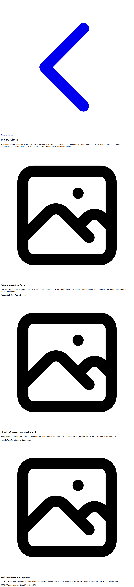
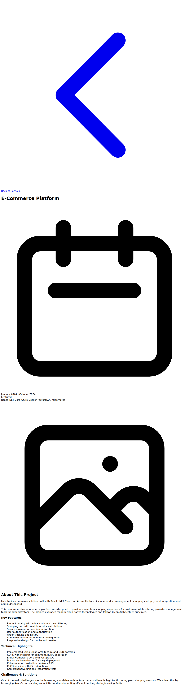
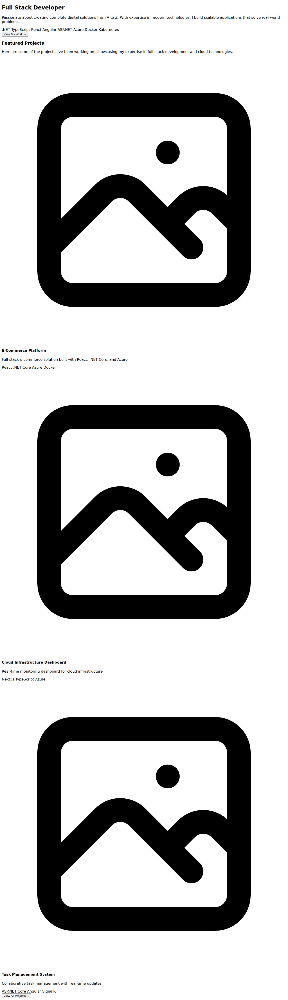

# Portfolio Feature Architecture

## Overview

The portfolio feature fetches project data from the backend API and displays it with server-side rendering (SSR) for optimal SEO. The implementation follows a vertical/feature-sliced architecture with Redux Toolkit for state management.

## Architecture Decisions

### Server-Side Rendering (SSR)

All portfolio pages are server-rendered for SEO benefits:
- **Portfolio List Page** (`/portfolio`): Fetches all projects sorted by date (newest first)
- **Portfolio Detail Page** (`/portfolio/[id]`): Fetches individual project details
- **Home Page Featured Projects**: Fetches featured projects for the homepage

### Redux Integration

The application uses Redux Toolkit with RTK Query for:
- **Centralized State Management**: Redux store configured in `/lib/store`
- **API Client**: RTK Query endpoints defined in `/lib/api/projectsApi.ts`
- **Client-Side Hydration**: After SSR, Redux can manage client-side state transitions

### Feature Organization

Following vertical/feature-sliced architecture with shared API layer:
```
lib/api/
├── baseApi.ts            # Shared API client and types
└── projectsApi.ts        # RTK Query configuration

app/portfolio/
├── page.tsx              # Portfolio list page (SSR)
├── [id]/
│   └── page.tsx          # Portfolio detail page (SSR)
└── lib/
    └── api.ts            # SSR-specific wrappers

lib/store/                # Redux configuration
```

The base API client is reused by both the Redux layer (RTK Query) and the SSR layer, eliminating duplication and ensuring consistency.

## API Endpoints

### Backend Endpoints (ASP.NET Core)

1. **GET /api/projects** - Get all projects
   - Returns: `ProjectDto[]`
   - Sorted by date on frontend (newest first)

2. **GET /api/projects/featured** - Get featured projects
   - Returns: `ProjectDto[]`
   - Only projects marked as featured

3. **GET /api/projects/{id}** - Get project by ID
   - Returns: `ProjectDto` or 404
   - For detail pages

### Frontend API Layer

#### Base API Client (`/lib/api/baseApi.ts`)

Shared API configuration and utilities used by both SSR and Redux:
- `getApiUrl()` - Returns the configured API URL (relative in production, full URL in development)
- `getProjectsBaseUrl()` - Returns the projects API base URL
- `fetchProjects(endpoint)` - Base function for fetching project lists with Zod validation
- `fetchProject(endpoint)` - Base function for fetching a single project with Zod validation
- `ProjectSchema` - Zod schema for runtime validation of API responses
- `Project` type - TypeScript type inferred from Zod schema

**Validation**: All API responses are validated using Zod schemas to ensure type safety at runtime.

#### Server-Side API (`/app/portfolio/lib/api.ts`)

Server-side wrapper functions that use the base API client:
- `fetchAllProjects()` - Fetches and sorts all projects
- `fetchFeaturedProjects()` - Fetches featured projects
- `fetchProjectById(id)` - Fetches single project

These functions add business logic (like sorting) on top of the base API.

#### RTK Query (`/lib/api/projectsApi.ts`)

Redux Toolkit Query configuration that uses the base API client:
- `useGetAllProjectsQuery()` - React hook for all projects
- `useGetFeaturedProjectsQuery()` - React hook for featured projects
- `useGetProjectByIdQuery(id)` - React hook for project by ID

All three layers share the same base API configuration and Project type.

## Data Flow

### Server-Side Rendering Flow

1. Next.js receives page request
2. Server component calls fetch helper (e.g., `fetchAllProjects()`)
3. Fetch helper calls backend API with `cache: 'no-store'`
4. Data is rendered into HTML
5. HTML sent to browser with full SEO benefits

### Client-Side Hydration Flow

1. Page loads with SSR'd HTML
2. React hydrates the page
3. Redux Provider wraps the application
4. RTK Query can be used for subsequent data fetching
5. Client-side navigation uses optimistic updates

## ProjectDto Schema

```typescript
// Zod schema with runtime validation
const ProjectSchema = z.object({
  id: z.string().uuid(),
  startDate: z.string().datetime(),
  endDate: z.string().datetime(),
  shortDescription: z.string(),
  longDescription: z.string(),
  image: z.string().url(),
  featured: z.boolean(),
  title: z.string().min(1),
  skills: z.array(z.string()),
});

// TypeScript type inferred from schema
type Project = z.infer<typeof ProjectSchema>;
```

**Validation**: All API responses are validated at runtime using Zod, ensuring type safety and catching malformed data early.

## Page Components

### Portfolio List (`/app/portfolio/page.tsx`)

**Features:**
- SSR data fetching
- Sorted by date (newest to oldest)
- Click to navigate to detail page
- Featured projects displayed prominently
- Responsive grid layout



### Portfolio Detail (`/app/portfolio/[id]/page.tsx`)

**Features:**
- SSR data fetching by ID
- Full project information display
- Formatted dates
- Skill badges
- Back navigation to portfolio list



### Home Page Featured Projects (`/app/home/page.tsx`)

**Features:**
- SSR fetching of featured projects
- Display up to 3 featured projects
- Click to navigate to detail page
- Link to full portfolio



## Configuration

### Environment Variables

```bash
# .env.local (development only)
NEXT_PUBLIC_API_URL=http://localhost:5035
```

**Note**: In production, the application uses relative URLs (same Docker container) and does not require `NEXT_PUBLIC_API_URL`. The environment variable is only used for local development to point to the API server running on a different port.

### Redux Store Setup

The Redux store is configured in `/lib/store/index.ts`:
- RTK Query middleware enabled
- Projects API slice integrated
- Store provider wraps app in root layout

## SEO Optimization

All portfolio pages are server-rendered with:
- Fresh data on each request (`cache: 'no-store'`)
- Full HTML content for search engine crawlers
- Dynamic routes for individual project pages
- Proper metadata and page titles

## Future Enhancements

Potential improvements:
- **Static Generation**: Consider ISR for better performance
- **Caching Strategy**: Add Redis caching for frequently accessed projects
- **Pagination**: Add pagination for large project lists
- **Filtering**: Add client-side filtering by skills or date range
- **Search**: Implement project search functionality
- **Optimistic Updates**: Use RTK Query for smoother client-side updates
